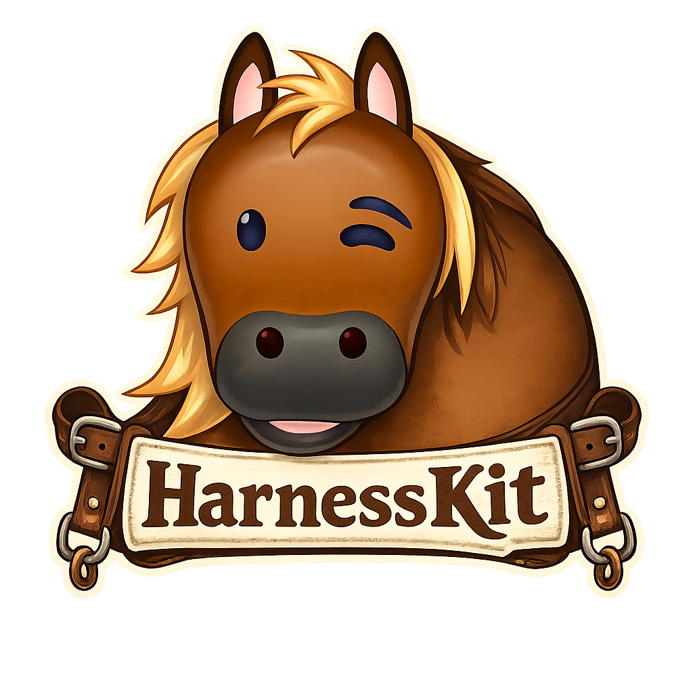

<p align="center">
  
</p>

<h1 align="center">HarnessKit · Harness 工程骨架与 HITL 引导基座</h1>

<p align="center">
  <em>帮助用户先理清需求，再基于骨架快速构建可执行 Harness 工程</em>
</p>

<p align="center">
  
  
  
</p>

---

## 项目愿景

AI 编码项目常见问题不是“写不出代码”，而是“写了之后不断返工”：上下文缺失、范围漂移、验收模糊、交接断层。  
HarnessKit 提供一套 Markdown-first 的 Harness 工程骨架与参考体系，把“先对齐再实现”变成可执行流程：通过 HITL 先澄清需求，再按既有骨架填充项目事实，从项目原点采集到范围定义、规则生成、验证设计、会话交接与锁定，形成稳定协作闭环。

## 核心能力

### 1. HITL 分轮启动流程

通过 `workflows/01-08` 将复杂需求拆成可访谈、可确认、可落地的阶段：

- 项目原点采集
- 范围定义
- 项目画像捕获
- Agent 规则生成
- 功能拆解
- 验证设计
- 会话交接
- Harness 锁定

### 2. 骨架化目录与参考样例

提供骨架目录和参考样例，便于按场景快速填充，而不是绑定固定业务模板：

- `minimal-harness`
- `ai-agent-project`
- `web-app-project`
- `backend-project`
- `hackathon-project`

### 3. 标准化文档闭环

统一的 `ai/*.md` 文档集合覆盖完整开发协作链路：

- `product-origin`：问题来源与背景约束
- `project-profile`：项目画像与边界信息
- `scope`：做什么 / 不做什么
- `feature-list`：功能拆解与优先级
- `verification`：验收与验证设计
- `progress`：开发进展与阶段结果
- `session-handoff`：跨会话交接
- `risk-register`：风险识别与处置
- `decision-log`：关键决策记录

### 4. Checklist 驱动质量控制

通过启动前、开发前后、完整性、防漂移清单降低遗漏：

- `harness-startup-checklist`
- `before-coding-checklist`
- `after-coding-checklist`
- `harness-completeness-checklist`
- `anti-drift-checklist`

### 5. Sub-agent 协作约束（关键）

已内建 sub-agent 规则，确保并行协作不失控：

- 下发任务必须写明：目标、边界、输入、输出、验收标准
- sub-agent 仅可在授权区域修改，不得越权
- 多个 sub-agent 不可并发修改同一文件
- 冲突由主 agent 统一整合与记录

## 产品亮点

- **Markdown-first**：零平台依赖，任意代码仓可落地
- **骨架 + 流程双驱动**：既有可填充骨架，也有 HITL 执行顺序
- **未知显式化**：所有未知统一标记 `TODO`，避免伪确定性
- **可审计协作**：决策、风险、验证、交接全链路可追溯
- **工具中立**：可用于 Codex / Claude Code / Cursor 等环境

## 快速开始

### 环境要求

- 任意 Git 仓库（推荐）
- 支持 Markdown 的编辑环境
- 可运行 AI Agent 的开发工作台（如 Codex / Claude Code / Cursor）

### 5 分钟上手

1. 选择骨架（例如 `templates/minimal-harness/` 作为起点）。
2. 复制到目标项目目录（通常为 `ai/`）。
3. 按 `workflows/01-08` 完成 HITL 访谈，澄清用户需求后再填充骨架中的 `TODO`。
4. 开发前必读：`AGENTS.md`、`product-origin.md`、`scope.md`、`feature-list.md`。
5. 开发后必更：`progress.md`、`verification.md`、`session-handoff.md`。

## 最佳实践

- 先定义边界，再进入实现
- 每个功能都写验收标准与验证步骤
- 每轮只更新本轮相关文档，保持小步迭代
- 不确定信息写 `TODO`，不猜测不编造
- 每次会话结束都更新 `session-handoff`
- 使用 sub-agent 前先拆分文件责任，避免编辑冲突

## 常见误区

- 只复制骨架，不完成 `TODO`
- 只写任务描述，不写验收标准
- 开发后不更新 `progress` 与 `session-handoff`
- 在通用模板中写入具体项目事实
- 多个 sub-agent 并发改同一文件

## 项目结构

```text
Harness-Kit/
├── docs/                         # 概念、原则、指南、路线图
├── workflows/                    # 01-08 HITL 访谈流程
├── checklists/                   # 启动/开发前后/完整性/防漂移清单
├── templates/                    # 可复用 Harness 骨架
├── examples/                     # 示例 Harness（演示用途）
├── skill/harnesskit-bootstrap/   # Bootstrap Skill + 骨架 + 参考资料
├── assets/                       # 视觉资源（项目图标等）
└── AGENTS.md                     # 仓库级维护规则
```

## 仓库约束

- 本仓库是 Markdown-first 文档项目
- 不添加程序代码，不创建 CLI，不创建 `src/`
- 不创建 `package.json`、`tsconfig.json`
- 新增内容必须服务于 Harness 启动、HITL、骨架、清单或示例
- 示例必须包含：`This is an example harness for demonstration only.`

## 适用人群

- 需要让 AI 编码“先对齐后执行”的个人开发者
- 需要跨会话稳定协作的团队
- 需要降低返工率、提升交接质量的项目负责人

## 许可证

本项目采用 [MIT License](./LICENSE)。

